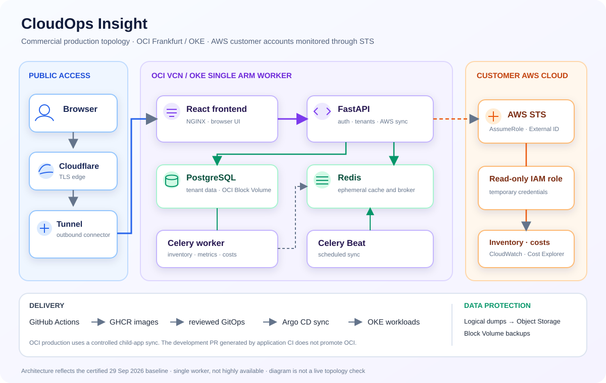

# CloudOps Insight

[](https://github.com/ridhampansara27/cloudops-insight/actions/workflows/ci-cd.yml)


**A multi-tenant cloud operations and FinOps platform.** Connect customer AWS accounts through read-only cross-account roles, bring inventory, health, costs and recommendations into workspace-scoped dashboards, and run the application on OCI OKE with reviewed GitOps delivery.

**Live application:** [cloudopsinsight.tech](https://cloudopsinsight.tech) · **Source of deployed configuration:** [cloudops-gitops](https://github.com/ridhampansara27/cloudops-gitops) · **Cloud infrastructure:** [cloudops-infrastructure](https://github.com/ridhampansara27/cloudops-infrastructure)

> [!IMPORTANT]
> **Current host: OCI OKE in Frankfurt.** AWS EKS files are historical hosting material; AWS remains the cloud that customer accounts connect for monitoring. The certified 29 September 2026 baseline used application image `sha-29d8aede6537165e8cf051641c6b6f3f79709839` and GitOps revision `473ad08567eb32d8ca09c59fdeb7c9199c07e3ff`. These are snapshot identifiers, not a substitute for checking current Argo CD state.

**Explore:** [Architecture](#architecture) · [Capabilities](#capabilities) · [Technology](#technology-and-versions) · [Run locally](#local-development-on-windows) · [Delivery and recovery](#delivery-rollback-and-recovery)

## Architecture



The browser reaches the React frontend through Cloudflare and an outbound Tunnel connector. FastAPI and Celery share PostgreSQL for tenant data and Redis for cache and task coordination. The backend assumes temporary credentials through AWS STS using each customer's role and External ID; customer access keys are not stored in the browser. [Detailed application architecture](docs/architecture.md) covers tenant boundaries, AWS trust, and data recovery.

| Repository | Owns | Production boundary |
|---|---|---|
| **This repository** | React frontend, FastAPI backend, tests, migrations, image build | CI publishes SHA-tagged images; application changes do not directly sync OKE |
| [cloudops-gitops](https://github.com/ridhampansara27/cloudops-gitops) | Helm chart, OCI values, Argo CD applications, backup CronJob | Reviewed OCI values and controlled child-application sync |
| [cloudops-infrastructure](https://github.com/ridhampansara27/cloudops-infrastructure) | Terraform for OCI network, OKE, volumes, backup storage and recovery resources | Separate authenticated plan and apply |

## Capabilities

- Workspaces with owner, admin, member, and viewer roles, invitations, and tenant-scoped access.
- Email verification, password reset, rotating refresh sessions, rate limiting, and account deletion.
- AWS onboarding with a generated External ID and STS `AssumeRole`; no customer access keys are stored.
- EC2, RDS, ECS, load balancer, and S3 inventory; CloudWatch metrics and Cost Explorer synchronization.
- Dashboards, budgets, incidents, recommendations, and integration disconnect/removal workflows.
- Celery Beat and Redis-backed workers; PostgreSQL for persistent application data.

The live values are in [`cloudops-gitops/environments/oci-dev`](https://github.com/ridhampansara27/cloudops-gitops/tree/main/environments/oci-dev), despite the historical directory name. AWS EKS **hosting** is retired; AWS **customer monitoring** remains supported.

## Repository map

| Path | Purpose |
|---|---|
| `frontend/` | React SPA, browser routes, UI, NGINX container |
| `backend/app/` | FastAPI routes, services, models, AWS adapters, Celery tasks |
| `backend/migrations/` | Alembic schema history; required for existing databases |
| `backend/tests/` | Unit, HTTP, PostgreSQL, Redis, auth, and tenant-boundary tests |
| `compose.yaml` | Local PostgreSQL, Redis, API, worker, Beat, frontend |
| `deploy/helm/`, `deploy/kind/` | Local Kind deployment; live OKE chart is in GitOps |
| `.github/workflows/ci-cd.yml` | Checks, multi-platform builds, scans, image publication, development PR |

## Technology and versions

These are locked dependencies or configured image tags, **not a live-cluster inventory**.

| Component | Version | Source |
|---|---|---|
| Python / Node.js | 3.13 / 22 | Dockerfiles and CI |
| FastAPI / SQLAlchemy / Celery | 0.141.1 / 2.0.51 / 5.6.3 | `backend/poetry.lock` |
| boto3 / Alembic | 1.43.72 / 1.19.1 | `backend/poetry.lock` |
| React / React Router | 19.2.8 / 7.18.2 | `frontend/package-lock.json` |
| Vite / TypeScript | 8.2.0 / 6.0.3 | `frontend/package-lock.json` |
| Tailwind CSS / Base UI | 4.3.3 / 1.6.0 | `frontend/package-lock.json` |
| TanStack Query / Table / ECharts | 5.101.4 / 9.1.2 / 6.1.0 | `frontend/package-lock.json` |
| PostgreSQL / Redis | `17-alpine` / `7-alpine` | `compose.yaml` and OCI GitOps values |
| Local Helm chart | 0.1.0 | `deploy/helm/cloudops-insight/Chart.yaml` |

The broad `-alpine` image tags are not immutable digests. Review the [frontend security exception](frontend/docs/security-exceptions.md) before changing React Router or its runtime mode.

### Why these boundaries matter

| Concern | Implementation | Operational implication |
|---|---|---|
| Customer cloud access | Read-only cross-account IAM role, generated External ID, short-lived STS session | No customer access keys in frontend code or application records; the customer controls role revocation |
| Tenant separation | Workspace membership/role checks and organization-scoped records | Tenant tests use disposable PostgreSQL; this is application isolation, not database row-level security |
| Public access | HTTPS at Cloudflare, outbound Tunnel to OKE, secure host-only refresh cookie | The application does not expose a public OCI Load Balancer |
| Persistence | PostgreSQL on OCI Block Volume; logical and volume backup layers | An image rollback cannot reverse a migration or restore data |
| Availability | One ARM worker, one in-cluster PostgreSQL instance, ephemeral Redis | The current commercial host is not highly available; see the recovery runbooks |

## Local development on Windows

Prerequisites: Docker Desktop with Compose, Python 3.13, Poetry, Node.js 22, npm. Live AWS integration is optional for local UI and API work.

From the repository root in PowerShell:

```powershell
Copy-Item backend/.env.example backend/.env
Copy-Item frontend/.env.example frontend/.env.local
# In backend/.env, replace JWT_SECRET and AUTH_TOKEN_PEPPER with distinct
# random development values. Keep local secrets outside Git.
docker compose up -d postgres redis
Set-Location backend
poetry install
poetry run alembic upgrade head
poetry run uvicorn app.main:app --reload
```

In another PowerShell window, from the repository root:

```powershell
Set-Location frontend
npm ci
npm run dev
```

Open `http://localhost:5173`. Liveness is `http://localhost:8000/health/live`; readiness at `/health/ready` checks PostgreSQL and Redis. The local example disables public signup; local registration also needs mail delivery configured. Production signup is independently enabled in OCI GitOps values.

To run periodic AWS sync locally, start these commands in **separate** PowerShell windows from `backend/`:

```powershell
poetry run celery -A app.tasks.celery_app:celery_app worker --loglevel=INFO --concurrency=1
```

```powershell
poetry run celery -A app.tasks.celery_app:celery_app beat --loglevel=INFO
```

Alternatively, after creating `backend/.env`, `docker compose up --build` starts the whole container stack at `http://localhost:8080`. Compose credentials and exposed development ports are not a production recipe.

## Quality checks

```powershell
# Run from backend/
poetry run ruff check app tests scripts
poetry run ruff format --check app tests scripts
poetry run pytest -v
poetry run alembic check
```

```powershell
# Run from frontend/
npm ci
npm run check
```

PostgreSQL-backed and adversarial tenant tests require a disposable test database. CI provisions one and sets `TENANT_TEST_DATABASE_URL`; never point these tests at a shared or production database.

## Delivery, rollback, and recovery

The application workflow tests code, builds and scans `linux/amd64` and `linux/arm64` images, and publishes SHA-tagged images to GHCR from `main`. It proposes a GitOps PR for Kind and historical AWS development values. OCI promotion is a **separate reviewed GitOps change**, followed by a controlled Argo CD sync. Schema migration compatibility is checked before promotion.

GitOps owns the live Helm chart, deployment and rollback. Infrastructure owns OKE, Terraform state, volume backup policy, and Object Storage. See their runbooks for the exact recovery prerequisites; database restores must first be validated in an isolated target.

Read [SECURITY.md](SECURITY.md), [CONTRIBUTING.md](CONTRIBUTING.md), and [CHANGELOG.md](CHANGELOG.md). Do not commit `.env`, AWS credentials, database dumps, or generated Celery Beat schedules.
