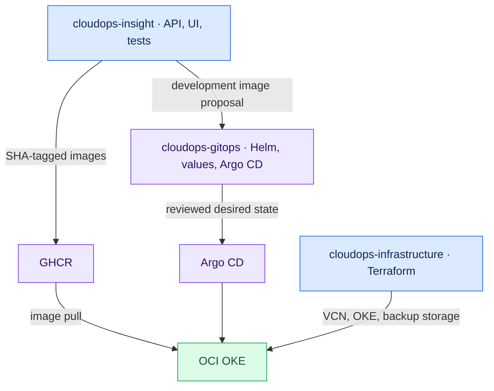
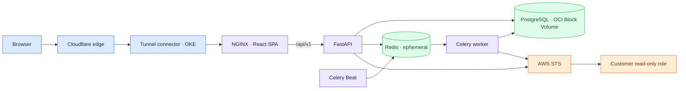
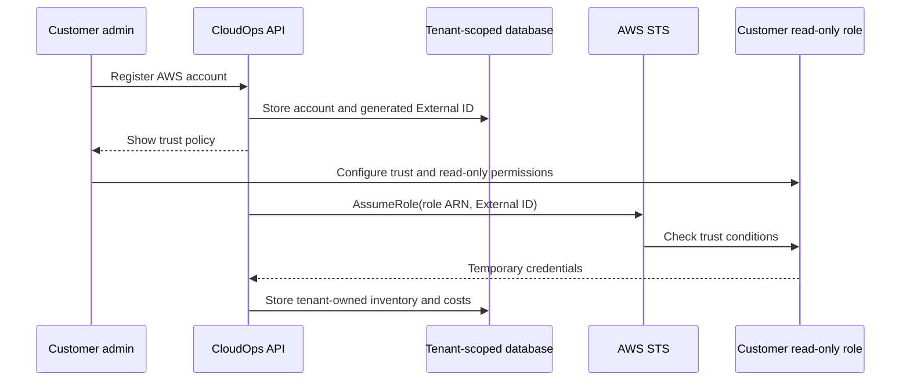
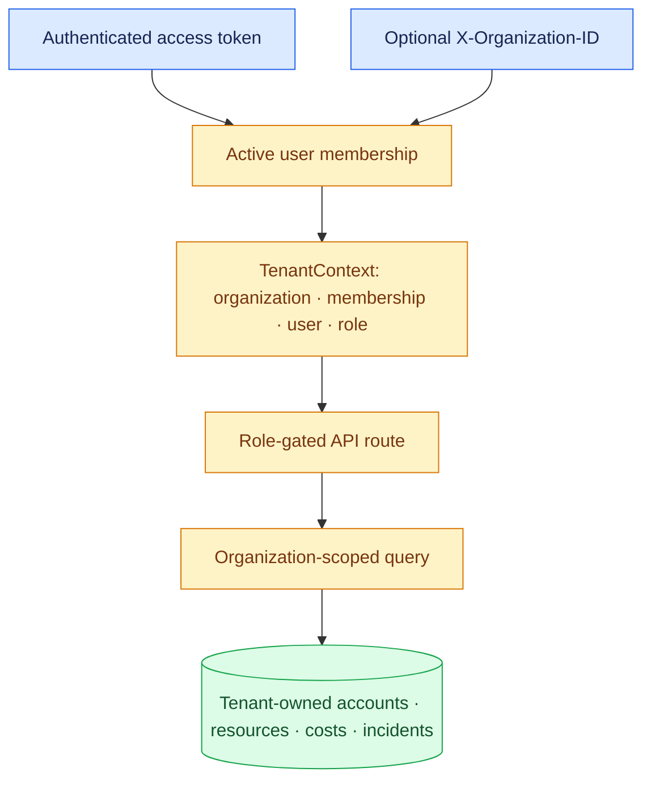

# Architecture and trust boundaries

This describes the certified commercial-launch application. [GitOps](https://github.com/ridhampansara27/cloudops-gitops) controls the deployed Helm configuration; [infrastructure](https://github.com/ridhampansara27/cloudops-infrastructure) controls OCI resources. Verify their current revisions before operating the live system.

## Three repositories

Application CI proposes Kind and historical AWS development image changes. OCI production promotion is a separate reviewed GitOps edit and controlled Argo CD sync.

## Current request and data paths

The OCI values disable application ingress, autoscaling, and NetworkPolicy. This single-worker OKE deployment is not highly available or network-policy enforced. Redis is ephemeral. PostgreSQL has persistent OCI Block Volume storage and separate logical and volume backup layers.

## AWS cross-account access

The session factory requires both role ARN and External ID; it does not fall back to platform credentials for customer discovery. Browser code never receives AWS credentials. Example policies in `docs/aws/` are templates, not proof of any customer's actual permissions.

## Multi-tenant authorization

Membership is checked for the selected organization. Roles are owner, admin, member, and viewer. Services and repositories scope owned records by organization ID, backed by tenant ownership migrations and HTTP/PostgreSQL regression tests. This describes application-layer isolation; it does not assert PostgreSQL row-level security.

## Lifecycle, recovery, and history

The backend implements account deletion, AWS disconnect with historical data retained, and AWS integration removal with imported data cleanup. Alembic owns schema history; never remove an applied migration.

OCI GitOps configures daily PostgreSQL logical dumps to Object Storage using a scoped upload credential. Terraform separately assigns a Block Volume backup policy and manages the bucket lifecycle. Restore requires an isolated target and verified backup. Rolling back an image does not reverse a schema migration or restore data; detailed procedures belong in GitOps and infrastructure runbooks.

The former EKS environment and ALB are historical hosting assets. OCI OKE plus Cloudflare Tunnel is the current host. AWS remains a monitored provider through customer-controlled cross-account roles. The OCI Argo CD root selects `argocd/oci-applications`, not the historical AWS application directory.
